# Evaluación Practica

## Ejercicio 1

#### 1. Instalar el IDE Visual Studio Code
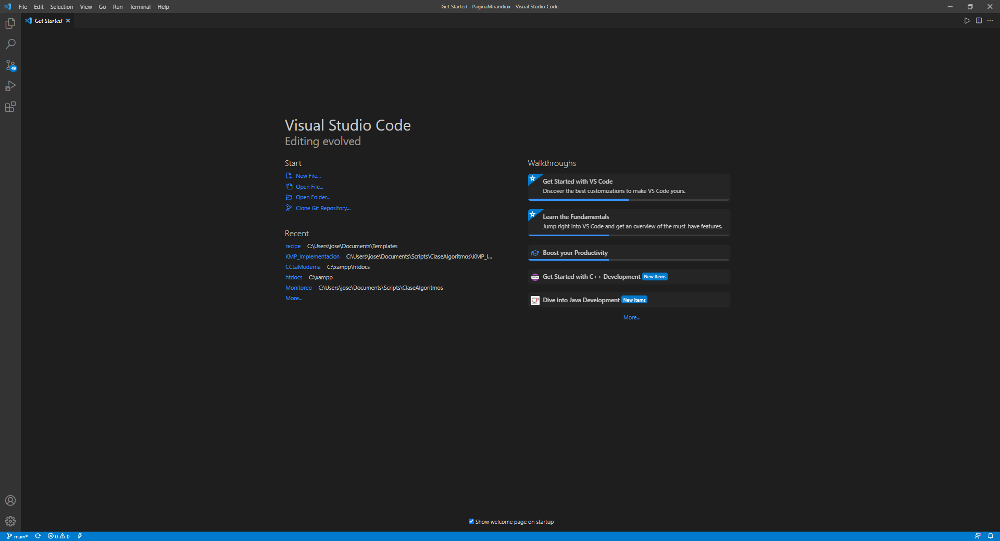

#### 2. Instalar GIT y GIT Bash
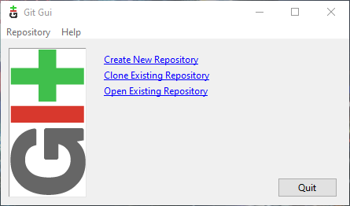
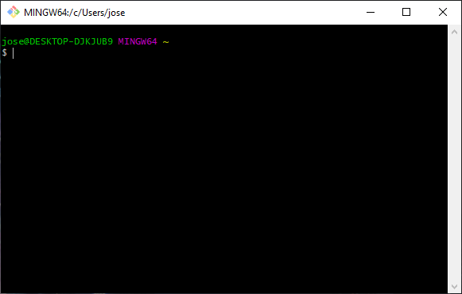

## Ejercicio 2

#### 1.	¿Qué es un servidor HTTP?
Un servidor HTTP es una computadora que ejecuta software para cargar sitios web. Esta computadora ejecuta software que distribuye paginas web cuando se requieren. El objetivo básico de un servidor HTTP es el almacenamiento, procesamiento, y entrega de paginas web a los usuarios. Esta comunicación se lleva a cabo usando el Protocolo de Transferencia de Hipertexto (HTTP).

#### 2. ¿Qué son los verbos HTTP? Mencionar los más conocidos
Un verbo HTTP es un método que indica la acción especifica a llevar a cabo sobre un recurso identificado por el URL que generó la petición. Los verbos HTTP primarios o más comúnmente utilizados (o métodos, como se les conoce apropiadamente) son POST, GET, PUT, PATCH, y DELETE. Hay otro número de verbos, sin embargo, estos se ocupan con menos frecuencia.

#### 3.	¿Qué es un request y un response en una comunicación HTTP? ¿Qué son los headers?
Un HTTP request es una petición desde un cliente a un servidor con el objetivo de acceder a un recurso en el servidor.
Un HTTP response es una petición desde un servidor a un cliente con el objetivo de proveer al cliente con el recurso requisitado anteriormente.

Los HTTP headers se escriben en para proveer al destinatario información sobre el mensaje, el remitente, y la forma en la que el remitente se desea comunicar con el destinatario.

#### 4.	¿Qué es un queryString? (En el contexto de una url)
Un query string es la porción de la URL donde los datos se pasan a la aplicación web o a la base de datos back-end.

#### 5. ¿Qué es el responseCode? ¿Qué significado tiene los posibles valores devueltos?
En el HTTP response que se envía al cliente, el código de estado o response code, es un número de tres dígitos que tiene como propósito informar el resultado de la petición del cliente, es decir, el HTTP request. Este se acompaña por una frase con la razón, conocida también como texto de estado, la cual resume el significado del código. Los códigos de estatus están clasificados por un rango de numérico, con cada clase de códigos teniendo el mismo significado básico:

-	El rango de 100-199 se clasifica como Informativo.
-	200-299 es Éxito.
-	300-399 es Redireccionamiento.
-	400-499 es Error de cliente.
-	500-599 es Error de servidor.

#### 6 ¿Cómo se envía la data en un GET y cómo en un POST?
Debido a que esta pregunta cubre muchos aspectos sobre como se envía la información entre los dos métodos, voy a compararlos a continuación:

| GET  | POST |
| ------------- | ------------- |
| En el método GET, la información está visible en el URL.  | En el método POST, la información no está visible en el URL.  |
| GET tiene una limitación sobre el largo de la información, generalmente de 255 caracteres.  | POST no tiene limitación, debido a que la información se sube a través del cuerpo del HTTP.  |
| GET tiene mejor ejecución a comparación de POST debido a su naturaleza simple de concatenar la información al URL. | POST tiene peor ejecución a comparación de GET debido al tiempo gastado en concatenar la información al cuerpo del HTTP. |
| Este método soporta solamente enviar cadenas de caracteres. | Este método soporta diferentes tipos de datos, como cadenas de caracteres, numérico, binario, etc. |
| Los parámetros GET se almacenan en el historial del navegador. | Los parámetros POST no se almacenan en el historial del navegador. |

#### 7. ¿Qué verbo http utiliza el navegador cuando accedemos a una página?
Normalmente utiliza un GET request.

#### 8. Explicar brevemente qué son las estructuras de datos JSON y XML dando ejemplo de estructuras posibles.
- JSON significa Notacion de Objectos Javascript (JSON)
- JSON es un formato ligero para almacenar y transportar datos.
- JSON se ocupa frecuentemente cuando se envían datos de un servidor a una página web.
- JSON es autodescriptivo y fácil de entender.

Un ejemplo de estructura posible para un JSON es el siguiente:

```
{ "employees":[
    {"firstName":"John", "lastName":"Doe"},
    {"firstName":"Anna", "lastName":"Smith"},
    {"firstName":"Peter", "lastName":"Jones"}
] }
```

- XML significa Lenguaje de Marcado Extensible (XML).
- XML es un lenguaje de marcado similar a HTML.
- XML fue diseñado para almacenar y transportar datos.
- XML fue diseñado para ser autodescriptivo.

Un ejemplo de estructura posible para un XML es el siguiente:

```
<note>
  <to>Tove</to>
  <from>Jani</from>
  <heading>Reminder</heading>
  <body>Don't forget me this weekend!</body>
</note>
```

#### 9.	Explicar brevemente el estándar SOAP
SOAP es un acrónimo que significa Protocolo de Acceso de Objeto Simple (SOAP). Es un protocolo de mensajería basado en XML para intercambiar información entre computadoras. SOAP es una aplicación de la especificación XML.

#### 10. Explicar brevemente el estándar REST Full
RESTFUL API es un acrónimo que significa Interfaz de Programación de Aplicaciones de Transferencia de Estado Representacional. Es un protocolo de mensajería para intercambiar información entre computadoras. La representación de estado puede variar, ésta puede ser en formato JSON, XML, o HTML. REST se prefiere sobre de SOAP debido a que ocupa menos ancho de banda, aunque tiene sus desventajas.

#### 11. ¿Qué son los headers en un request? ¿Para qué se utiliza el key Content-type en un header?
Los HTTP headers en un request le permiten al cliente y al servidor pasar información adicional sobre como manejar el mensaje, como comunicarse, o información general o adicional acerca del cuerpo del mensaje, entre otros. Estos se pueden agrupar de acuerdo a su tipo.

Por ejemplo el header 'Content-type' es un header de tipo representación ya que se utiliza para declarar el tipo de dato original del recurso (antes de la aplicación de cualquier tipo de codificación para su envío).  Ejemplos del contenido de este pueden ser: audio, font, image, text, video, entre otros.

## Ejercicio 3

#### 1. Descargar el POSTMAN:

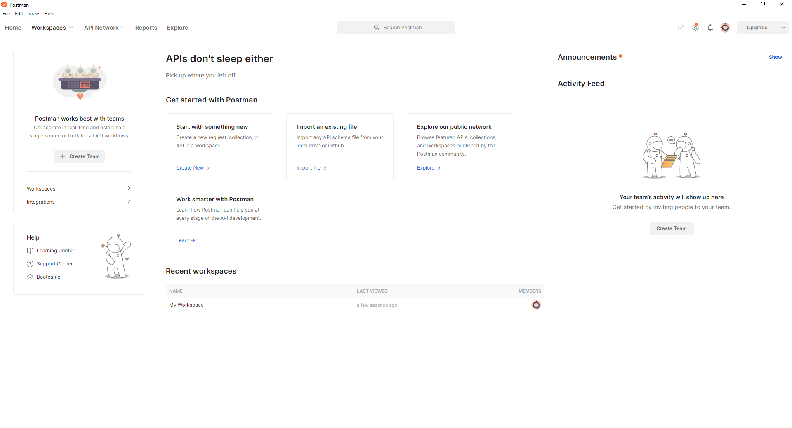

#### 2. Realizar un request GET a la URL: https://procontacto-reclutamiento-default-rtdb.firebaseio.com/contacts.json

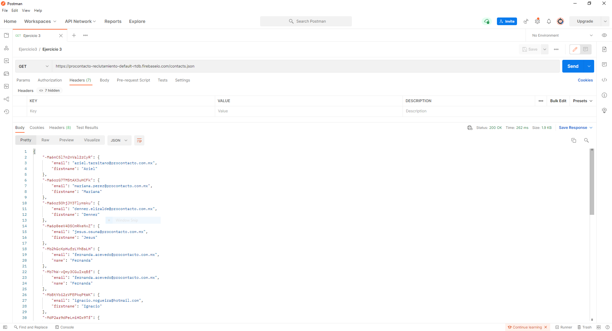

#### 3.	Realizar un request POST a la URL anterior, y con body:

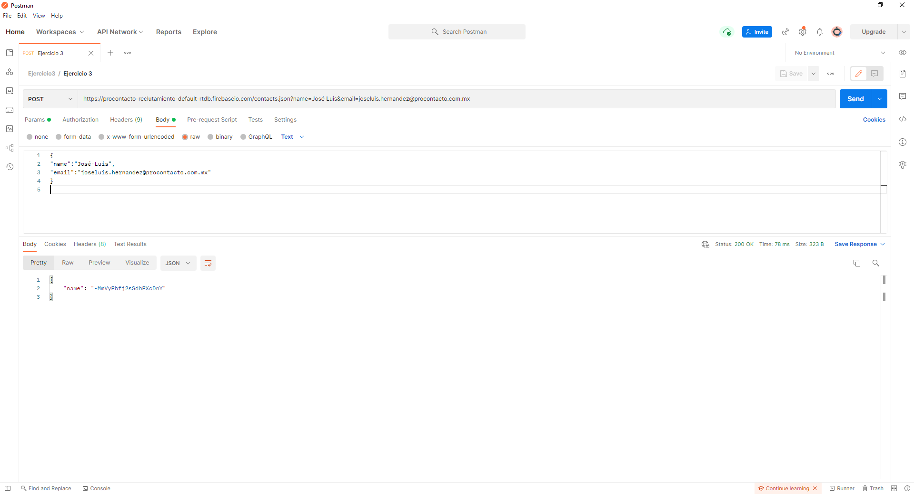

#### 4. Realizar nuevamente un request GET a la URL: https://procontacto-reclutamiento-default-rtdb.firebaseio.com/contacts.json

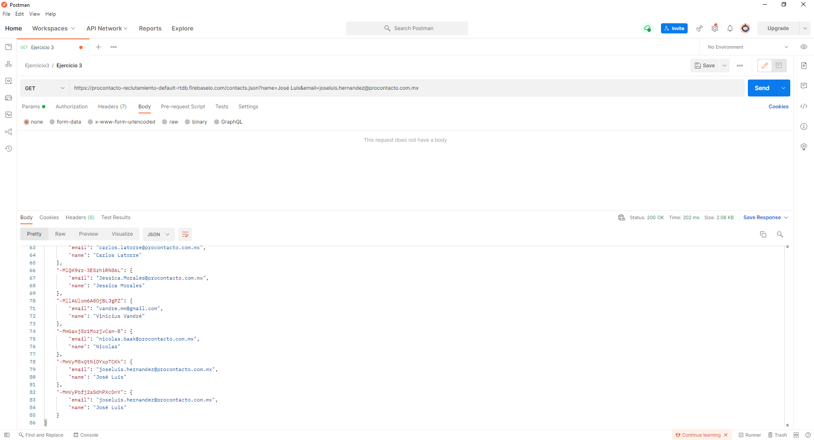

#### ¿Qué diferencias se observan entre las llamadas el punto 1 y 3?
En la llamada del punto 1, GET, estamos pidiendo información al servidor. En la llamada del punto 3, GET, después de haber enviado información al servidor con POST recibimos una respuesta en formato JSON con la llave nombre seguido del valor con una cadena de caracteres.

## Ejercicio 4

#### Realizar los siguientes módulos de Trailhead:
https://trailblazer.me/id/josehernandez2

## Ejercicio 5

#### Explicar que son conceptualmente, qué datos almacenan en forma estándar y cómo se relacionan el resto (algunos no se relacionan entre sí) cada uno de los siguientes objetos de Salesforce:

#### Nota:
Debido a la larga extensión de campos que almacena cada objeto me limitaré a listar solamente 5 por objeto a manera representativa.

#### Lista de Texto:

#### 1.	Lead:
Representa un prospecto o comprador eventual.

| Dato | Tipo |
| ------------- | ------------- |
| Address | Address |
| AnnualRevenue | Currency(18, 0) |
| CleanStatus | PickList |
| Company | Text(255) |
| CompanyDunsNumber	 | Text(9) |

#### 2.	Account
Representa una cuenta individual, la cual es una organización o una persona que tiene contacto con el negocio (como clientes, competidores, y socios).

| Dato | Tipo |
| ------------- | ------------- |
| Name | Name |
| AccountNumber | Text(40) |
| OwnerId | Lookup(User) |
| Site | Text(80) |
| AccountSource | PickList |

#### 3.	Contact
Representa un contacto, la cual es una persona asociada a una cuenta.

| Dato | Tipo |
| ------------- | ------------- |
| AccountId | Lookup(Account) |
| AssistantName | Text(40) |
| AssistantPhone | Phone |
| Birthdate | Date |
| CleanStatus | PickList |

#### 4.	Opportunity
Representa una oportunidad, la cual es una venta o un trato pendiente.

| Dato | Tipo |
| ------------- | ------------- |
| AccountId | Lookup(Account) |
| Amount | Currency(16, 2) |
| CloseDate | Date |
| ContractId | Lookup(Contract) |
| CreatedById | Lookup(User) |

#### 5.	Product
Representa un producto que vende la organización.

| Dato | Tipo |
| ------------- | ------------- |
| IsActive | Checkbox |
| CreatebyId | Lookup(User) |
| DisplayUrl | URL(1000) |
| ExternalDataSourceId | Lookup(External Data Source) |
| ExternalId | Text(255) |

#### 6.	PriceBook
Representa un libro de precios que contiene la lista de productos que vende la organización.

| Dato | Tipo |
| ------------- | ------------- |
| IsActive | Checkbox |
| CreatebyId | Lookup(User) |
| Description | Text(255) |
| IsStandard | Checkbox |
| LastModifiedById | Lookup(User) |

#### 7.	Quote
Representa una cotización, la cual es una declaración del precio o precios propuestos de un producto o servicio.

| Dato | Tipo |
| ------------- | ------------- |
| AccountId | Reference |
| AdditionalAddress | Address |
| AdditionalCity | Text(80) |
| AdditionalCountry | PickList |
| AdditionalLatitude | Double |

#### 8.	Asset
Representa un activo de valor comercial, tal como un producto vendido por la compañía o un competidor, que un cliente ha comprado o instalado.

| Dato | Tipo |
| ------------- | ------------- |
| AccountId | Lookup(Account) |
| AssetLevel | Number(9, 0) |
| Name | Text(255) |
| OwnerId | Lookup(User) |
| AssetProvidedById | Lookup(Account) |

#### 9.	Case
Representa un evento o caso, en el cual el cliente tiene un problema o tema.

| Dato | Tipo |
| ------------- | ------------- |
| AccountId | Lookup(Account) |
| AssetId | Lookup(Asset) |
| BusinessHoursId | Lookup(Business Hours) |
| CaseNumber | Auto Number |
| Origin | PickList |

#### 10.	Article
Representa articulo por el cual se abrió el evento o caso, sirve de apoyo para resolver el caso.

| Dato | Tipo |
| ------------- | ------------- |
| ArticleLanguage | PickList |
| ArticleVersionNumber | Integer |
| CaseId | Reference |
| IsSharedByEmail | Integer |
| IsSharedByEmail | Reference |

#### Diagrama UML:


## Ejercicio 6
#### A.	Consultar tu ID haciendo un GET con POSTMAN a este WS:
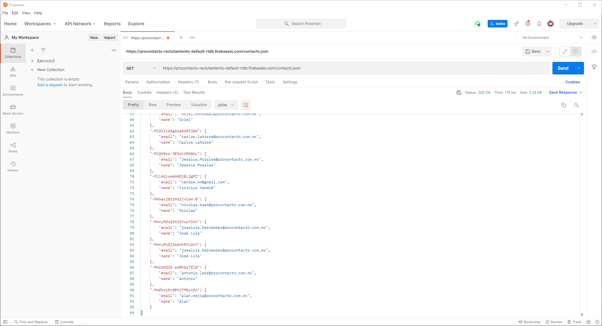

#### B.	Agregar un campo al objeto Contact llamado idprocontacto de tipo texto de 255 caracteres.
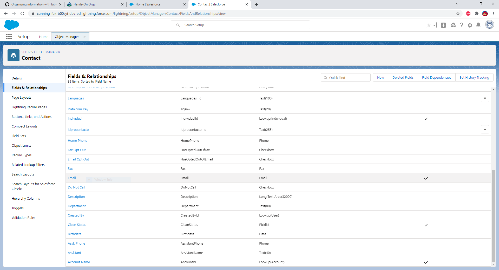

#### C.	Desarrollar un trigger para que cuando un usuario Modifica o Crea un contacto de Salesforce completando el campo generado el punto B con el ID del punto A, se invoque al Web Service con el idprocontacto obtenga los datos de email de la respuesta y actualice el campo email del contacto. Usar Playground 1.

#### Apex trigger:
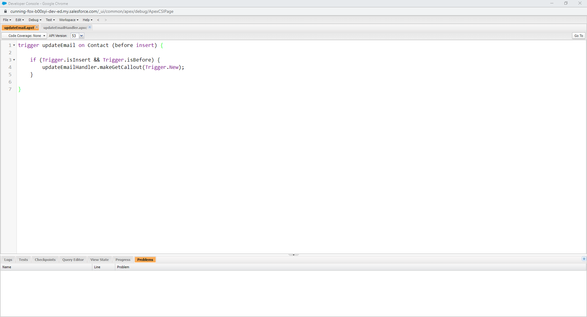

#### Handler class para trigger:
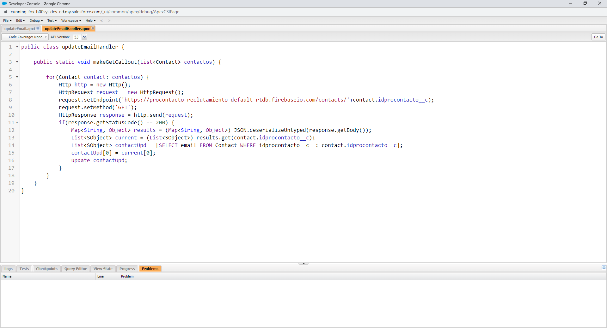

## Ejercicio 7

### Soluciones de Salesforce

#### A.	¿Qué es Salesforce?
Salesforce es una plataforma de gestión de relaciones con el cliente o un CRM.

#### B.	¿Qué es Sales Cloud?
Es un módulo de Salesforce que permite gestionar de forma eficiente las relaciones con los clientes y la colaboración entre equipos comerciales. Esta se especializa en casos y servicios.

#### C.	¿Qué es Service Cloud?
Es otro módulo similar a Sales Cloud y se especializa en la generación de prospectos, incremento de ventas, y oportunidades.

#### D.	¿Qué es Health Cloud?
Es otro módulo enfocado al área de la salud. Esta incorpora servicios de gestión de registros y relaciones medico paciente.

#### E.	¿Qué es Marketing Cloud?
Es otro módulo enfocado al área de mercadotecnia.

### Funcionalidades de Salesforce

#### A.	¿Qué es un RecordType?
Es una forma de ofrecer procesos diferentes, variables de selección, y diseños de página a diferentes usuarios.

#### B.	¿Qué es un ReportType?
Determina qué tipo de registros y campos aparecen en un reporte. Hay dos tipos: standard report types y custom report types.

#### C.	¿Qué es un Page Layout?
Controla el diseño y la organización de botones, campos, controles-s, Visualforce, enlaces personalizables, y listas relacionadas en páginas de registros de objetos.

#### D.	¿Qué es un Compact Layout?
Un diseño compacto despliega los registros clave en la aplicación móvil de Salesforce, Lightning Experience, y en las integraciones de Outlook y Gmail.

#### E.	¿Qué es un Perfil?
Los perfiles definen como un usuario obtiene acceso a objetos y datos, y los perfiles determinan lo que los usuarios pueden hacer dentro de la aplicación.

#### F.	¿Qué es un Rol?
Un rol determina el nivel de permisos que tiene el usuario dentro de la aplicación. Cada rol tiene permisos que se van expandiendo dentro de la aplicación.

#### G.	¿Qué es un Validation Rule?
Son reglas que verifican que los datos que el usuario a tecleado en un campo o registro coinciden con los estándares que se han predefinido antes de que este se pueda guardar.

#### H.	¿Qué diferencia hay entre una relación Master Detail y Lookup?
El Máster Detail es una relación padre-hijo en la que el objecto maestro controla ciertos comportamientos del objeto de detalle. Por ejemplo, cuando se elimina un registro del objeto maestro, también se eliminan sus registros de detalles relacionados. Esto no pasa en Lookup, donde no hay efecto de eliminación o seguridad.

#### I.	¿Qué es un Sandbox?
Es una copia de la organización en un entorno separado la cual se puede usar para una variedad de propósitos, como pruebas o entrenamiento.

#### J.	¿Qué es un ChangeSet?
Son usadas para enviar personalizaciones de una organización Salesforce a otra.

#### K.	¿Para qué sirve el import Wizard de Salesforce?
Es una herramienta para importar información masivamente.

#### L.	¿Para qué sirve la funcionalidad Web to Lead?
Se utiliza para recolectar la información de la pagina web de la organización y automatizar la generación de prospectos.

#### M.	¿Para qué sirve la funcionalidad Web to Case?
Igual a Web to Lead solamente que esta captura información para generar un caso de la pagina web de la organización.

#### N.	¿Para qué sirve la funcionalidad Omnichannel?
Es una función de servicio al cliente y consola que ayuda al enrutamiento automático de diferentes tipos de elementos de trabajo a los agentes de Salesforce.

#### O.	¿Para qué sirve la funcionalidad Chatter?
Es una aplicación de colaboración en tiempo real que le permite a los usuarios hablar y compartir información.

### Conceptos generales

#### A.	¿Qué significa SaaS?
Significa software como servicio.

#### B.	¿Salesforce es Saas?
Sí

#### C.	¿Qué significa que una solución sea Cloud?
Significa que el software o aplicación esta alojada por un proveedor externo y se entrega a los cliente a través de internet por un servicio.

#### D.	¿Qué significa que una solución sea On-Premise?
Que el software o aplicación se encuentra alojado localmente, en las computadoras o servidores de la organización o negocio, por ejemplo.

#### E.	¿Qué es un pipeline de ventas?
Es una manera organizada visual de llevar seguimiento de varios compradores potenciales a medida que avanzan a través de las diferentes etapas del proceso de compra.

#### F.	¿Qué es un funnel de ventas?
Es el viaje o camino que atraviesan lo clientes potenciales para poder hacer una compra.

#### G.	¿Qué significa Customer Experience?
Es como una empresa se relaciona con sus clientes en cada punto del viaje de su compra.

#### H.	¿Qué significa omnicanalidad?
Es la integración y cooperación de los diferentes canales que usa una organización para interactuar con sus clientes o consumidores.

#### I.	¿Qué significa que un negocio sea B2B?
Es un negocio realizado entre una empresa y otra.

#### J.	¿Qué significa que un negocio sea B2C?
Es un negocio realizado entre un negocio y un consumidor.

#### K.	¿Qué es un KPI?
Son indicadores clave de rendimiento (KPI). Medidas cuantificables para evaluar la eficacia de éxito de una campaña de marketing.

#### L.	¿Qué es una API y en qué se diferencia de una Rest API?
Las dos son API. REST es el estilo de arquitectura para conexiones de aplicaciones web.

#### M.	¿Qué es un Proceso Batch?
La automatización del procesamiento de una transacción para que se haga en masa.

#### N.	¿Qué es Kanban?
Kanban es un método de administración de flujo de trabajo para definir, administrar y mejorar servicios.

#### O.	¿Qué es un ERP?
Es un proceso usado por las compañías para gestionar e integrar las partes importantes de sus negocios.

#### P.	¿Salesforce es un ERP?
Sí

## Referencias por orden de uso:
- https://economictimes.indiatimes.com/definition/web-server
- https://rapidapi.com/blog/api-glossary/http-request-methods/
- https://www.restapitutorial.com/lessons/httpmethods.html#:~:text=The%20primary%20or%20most%2Dcommonly,or%20CRUD)%20operations%2C%20respectively.
- https://www.ibm.com/docs/en/cics-ts/5.2?topic=protocol-http-requests
- https://www.techopedia.com/definition/1228/query-string
- https://www.ibm.com/docs/en/cics-ts/5.2?topic=concepts-status-codes-reason-phrases
- https://www.guru99.com/difference-get-post-http.html
- https://www.codecademy.com/articles/http-requests
- https://www.w3schools.com/whatis/whatis_json.asp
- https://www.w3schools.com/xml/xml_whatis.asp
- https://www.tutorialspoint.com/soap/what_is_soap.htm
- https://www.astera.com/type/blog/rest-api-definition/
- https://developer.mozilla.org/en-US/docs/Glossary/Request_header
- https://developer.mozilla.org/en-US/docs/Web/HTTP/Basics_of_HTTP/MIME_types
- https://developer.salesforce.com/docs
- https://developer.salesforce.com/docs/atlas.en-us.object_reference.meta/object_reference/sforce_api_erd_products.htm
- https://www.salesforce.com/products/what-is-salesforce/
- https://www.marketinet.com/blog/sales-cloud-de-salesforce-funcionalidades-ventajas#gref
- https://getoncrm.com/what-is-the-key-difference-between-sales-cloud-vs-service-cloud/
- https://whatis.techtarget.com/definition/Salesforce-Health-Cloud#:~:text=Salesforce%20Health%20Cloud%20is%20a,relationship%20and%20record%20management%20services.&text=Through%20Private%20Communities%2C%20patients%20can,of%20visits%20to%20save%20time.
- https://isdicrm.com/what-is-salesforce-marketing-cloud/
- https://help-legacy.salesforce.com/articleView?id=sf.salesforce_help_map.htm&type=5#language-combobox
- https://developer.salesforce.com/docs/atlas.en-us.api.meta/api/relationships_among_objects.htm
- https://www.mstsolutions.com/technical/salesforce-omni-channel/#:~:text=Omni%2DChannel%20is%20a%20Customer,priority%2C%20skillset%2C%20and%20etc.
- https://www.infoworld.com/article/3226386/what-is-saas-software-as-a-service-defined.html
- https://www.xperience-group.com/cloud-vs-on-premise-software/#:~:text=Essentially%2C%20the%20fundamental%20difference%20between,accessed%20via%20a%20web%20browser.
- https://www.pipedrive.com/en/blog/sales-pipeline-fundamental-stages#whatisasalespipeline
- https://keap.com/product/sales-funnel
- https://www.oracle.com/cx/what-is-cx/
- https://www.marketingevolution.com/knowledge-center/topic/marketing-essentials/omnichannel
- https://www.investopedia.com/terms/b/btob.asp
- https://www.investopedia.com/terms/b/btoc.asp
- https://www.toucantoco.com/en/blog/top-10-marketing-kpis
- https://www.freelancinggig.com/blog/2018/11/02/what-is-the-difference-between-api-and-rest-api/#:~:text=While%20API%20is%20basically%20a,to%20build%20a%20web%20API.
- https://www.investopedia.com/terms/b/batch-processing.asp
- https://kanbanize.com/kanban-resources/getting-started/what-is-kanban
- https://www.investopedia.com/terms/e/erp.asp
